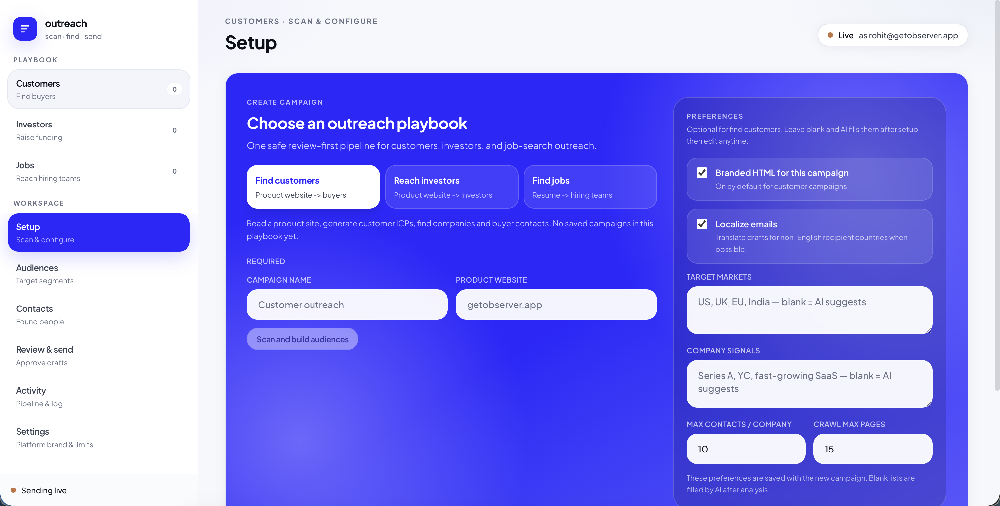
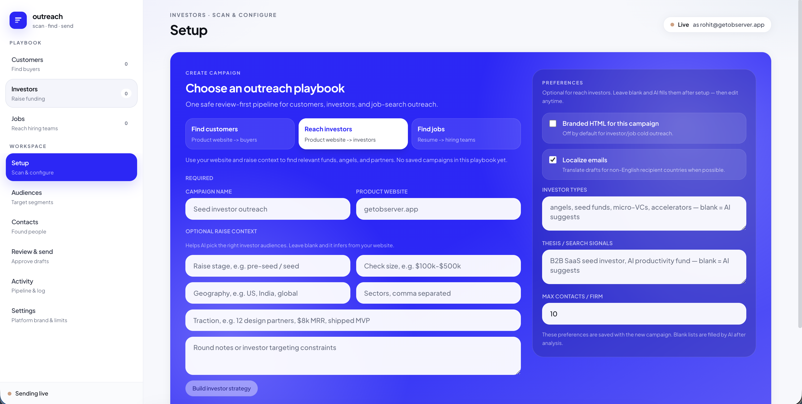
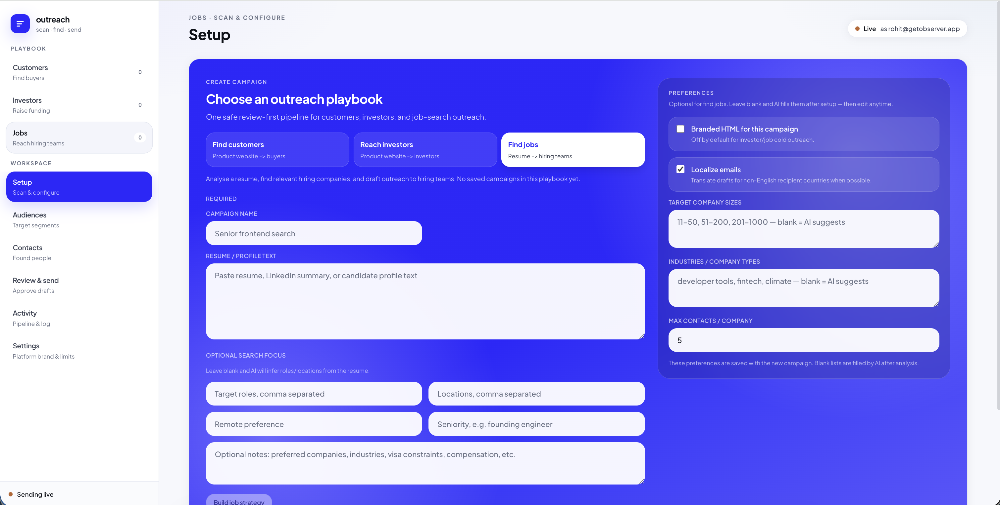

<div align="center">
  <a href="https://github.com/rohitmalhotra1420/ai-outreach-engine">
    
  </a>

  <h1>AI Outreach Engine</h1>

  <p>
    <strong>Open-source outbound that runs on your laptop.<br />
    Find customers. Reach investors. Land jobs.</strong>
  </p>

  <p>
    Pick a playbook. Feed it a website or a resume.<br />
    It figures out who to talk to, finds real people,<br />
    drafts the email — and waits for you before anything sends.
  </p>

  <p>
    <a href="https://github.com/rohitmalhotra1420/ai-outreach-engine/stargazers"></a>
    &nbsp;
    <a href="./LICENSE"></a>
    &nbsp;
    
    &nbsp;
    
  </p>
</div>

---

## Why this exists

I was shipping **[Observer](https://getobserver.app)** — a live AI meeting assistant — and hit the classic early-founder wall:

The product worked. The inbox was empty.

Sales tools wanted a seat license, owned my data, and treated “who should I email?” like a black box. I didn’t need a CRM empire. I needed a loop I could run myself: understand the product, find the right people, write something that doesn’t sound like spam, and stay cheap while learning.

So I built this. Then I opened it up.

Same empty-inbox problem exists when you’re job hunting — apply, wait, hear nothing. That’s why the **jobs** playbook exists: for me and other job seekers who want a clean way to reach hiring teams.

**AI Outreach Engine** is that outbound loop, MIT-licensed: promote a product like Observer, raise, or land a job — on your own machine.

Your database. Your API keys. Nothing leaves until you approve it.

---

## Three playbooks, one engine

Same pipeline. Different starting point. Different tone.

| Playbook | You give it | It finds | Emails sound like |
| --- | --- | --- | --- |
| **Find customers** | Product website | Buyer ICPs → companies → contacts | Short founder pitch for your product |
| **Reach investors** | Website + raise context | Funds, angels, partners that fit | Investor-native, plain by default |
| **Find jobs** | Resume + preferences | Search lanes (roles you want) → employers hiring → hiring contacts | Human outreach, not “Dear Recruiter” sludge |

For **Find jobs**, each search lane keeps two title lists separate: **roles you want** (drives job/employer search) and **people to contact** (Recruiters, Hiring Managers, CTOs — who get the email).

Leave targeting fields blank if you want — AI fills sensible defaults from the site or resume. Or lock in markets, thesis signals, industries yourself. Your call.

One local app for the three emails that actually move things — customers, capital, jobs — without three SaaS subscriptions.

<p align="center">
  
</p>

<p align="center">
  
</p>

<p align="center">
  
</p>

---

## How it works

```text
  Pick playbook
       ↓
  Setup          website crawl  or  resume analysis
       ↓
  Audiences      who to target + email templates (edit freely)
       ↓
  Prospect       search → companies → contacts → verify → draft
       ↓
  Review         edit drafts → approve → queue
       ↓
  Activity       jobs, failures, suppressions, rough spend
```

**Contact finding is a cheap waterfall** — no Apollo/Hunter seat:

1. Scrape public emails on the company domain
2. Find people via search (names + roles)
3. Guess patterns, verify with Reoon, stop on first `valid`
4. Remember what worked for that domain so the next person costs fewer credits

**Pattern probe order** (each address verified at most once per person):

1. Top-2 learned formats for that domain (by hit count from prior valid verifies)
2. Then the default order: `first@` → `first.last@` → `first.m@` → `flast@` → `firstlast@`

Learned formats live in SQLite (`domain_email_patterns`), global across campaigns. Hit count increments only on `valid`.

**Sending is boring on purpose.** Dry-run by default. Approval gate. Suppressions. Send window. Daily cap. Spacing. Plain-text only — draft body as written, no compliance footer.

<details>
<summary><strong>Automated vs manual</strong></summary>

<br />

**Automated**
- Site crawl / resume analysis
- Audience + template generation
- Company discovery, contact waterfall, verification
- Drafting with spam-phrase checks and length limits
- Compliance checks, send window, queue retries

**Still you (on purpose)**
- Approving every draft before send
- Verifying your sender domain in Brevo (SPF/DKIM), or creating a Gmail App Password
- Warming mailboxes if you outgrow free tiers
- Handling replies in your inbox (no reply tracking yet)

</details>

---

## What this is *not*

Not a cloud CRM. Not a lead marketplace. Not “AI SDR that blasts 10k emails while you sleep.”

It’s a local pipeline with a human gate. Good for founders who want control and a low bill. Bad if you want someone else to own the mess.

---

## What costs money

The **app is free**. You pay the APIs you plug in.

| Service | Used for | Free tier? | Reality |
| --- | --- | --- | --- |
| **OpenAI** | Analysis, audiences, drafts | Trial credit sometimes | Usually your biggest variable cost |
| **Firecrawl** | Product site crawl | Starter credits | Plain fetch is emergency fallback |
| **Serper** | Finding companies / people | Starter credits | ~$1 / 1,000 searches after |
| **Reoon** | Verify emails before draft | **20 credits/day** | Fine for demos; ~**$9.95/mo** once serious |
| **Brevo** | Live send (API) | **300 emails/day** | Needs verified domain; start in `dry_run` |
| **Gmail SMTP** | Live send as your Gmail | Google daily limits | App Password; From shows as you@gmail.com |

<details>
<summary><strong>Reoon — why the free tier feels tiny</strong></summary>

<br />

Deep checks burn multiple credits per address. Free ≈ **3–4 verified emails/day**. Enough to learn the UI. Not enough for real prospecting.

| Plan | Allowance | Price |
| --- | --- | --- |
| Free | 20 credits / day | $0 |
| Cheapest paid | **500 credits / day** (up to 15k / mo) | **~$9.95 / mo** |

Unverified addresses can still be collected — verification is what keeps bounce risk sane.

</details>

**Always free on your machine**
- Bun server + React UI
- SQLite database on disk
- Contact scrape + pattern guessing
- Manual add / CSV import
- `SENDER_PROVIDER=dry_run` — full pipeline, zero emails leave

> Tip: dry-run + free tiers first. Budget ~$10/mo for Reoon when you prospect for real. Flip Brevo on only when drafts look like something you’d send. Brand, compliance, windows, and targeting live in **Settings** — not `.env`.

---

## Quick start

### Prerequisites

- [Bun](https://bun.sh) 1.1+ — `curl -fsSL https://bun.sh/install | bash`
- API keys for the stages you want live (table above)

### Install & run

```bash
git clone https://github.com/rohitmalhotra1420/ai-outreach-engine.git
cd ai-outreach-engine

bun install
cp .env.example server/.env
# edit server/.env with your keys

bun run --cwd server migrate   # optional; also runs on server start
bun run dev
```

Open **[http://localhost:5273](http://localhost:5273)**.

Vite UI proxies `/api` → Bun at `http://localhost:8787`.

<details>
<summary><strong>Database</strong></summary>

<br />

- Default path: `server/data/outreach.db` (`DATABASE_PATH`)
- `.db` files and `server/data/` are gitignored
- Schema applies on first boot from `server/src/db/schema.sql`
- Clone → start → empty private DB. No dump required.

</details>

---

## Preferred stack

| Stage | Provider | Notes |
| --- | --- | --- |
| LLM | **OpenAI** | Only LLM provider (`reasoning` + `cheap` models) |
| Crawl | **Firecrawl** | Free credits cover personal use |
| Search | **Serper** | Cheap after free credits |
| Contacts | Scrape + pattern guess | Learns domain formats to cut verify spend |
| Verify | **Reoon** | Cheapest verifier that still helps |
| Send | **Brevo** or `dry_run` | 300 free/day — dry-run until ready |

---

## Configure `.env`

```bash
cp .env.example server/.env
```

```env
# LLM
OPENAI_API_KEY=...
# optional model overrides — see .env.example
# LLM_MODEL_REASONING=gpt-5-mini
# LLM_MODEL_CHEAP=gpt-5.4-nano

# Crawl + search + verify
FIRECRAWL_API_KEY=...
SERPER_API_KEY=...
REOON_API_KEY=...

# Sending — dry_run first, then brevo or gmail
SENDER_PROVIDER=dry_run
SENDER_FROM_NAME=You
# Brevo:
# BREVO_API_KEY=...
# BREVO_FROM_EMAIL=you@yourdomain.com
# BREVO_REPLY_TO=you@yourdomain.com
# Gmail SMTP (App Password):
# SENDER_PROVIDER=gmail
# GMAIL_FROM_EMAIL=you@gmail.com
# GMAIL_REPLY_TO=you@gmail.com
# GMAIL_APP_PASSWORD=xxxx xxxx xxxx xxxx
```

Leave `SENDER_PROVIDER=dry_run` until drafts look good. Everything else (brand, windows, caps, markets) is in the **Settings** tab.

---

## Use the app

1. **Pick a playbook** — Customers, Investors, or Jobs.
2. **Setup** — paste a domain (`getobserver.app` works as a ready example) or paste a resume for Jobs. Add raise/role context if you have it; leave blank to let AI fill.
3. **Audiences** — review ICPs / investor segments / job targets. Edit templates and search queries.
4. **Find companies** — runs search → extract → contacts → verify → draft.
5. **Contacts** — inspect emails, sources, evidence. Add or CSV-import anytime.
6. **Review & send** — edit, approve, queue. Countdown shows when a send window holds the message.
7. **Settings / Activity** — brand & limits; jobs, suppressions, spend.

Customer campaigns default to branded HTML. Investor campaigns default to plain text. You can flip HTML on/off per campaign.

---

## Commands

```bash
bun run dev                         # server + web
bun run --cwd server migrate        # apply schema.sql
bun run --cwd server test
bun run --cwd server typecheck
bun run --cwd web typecheck
bun run --cwd web build
```

---

## Project layout

```text
outreach-engine/
├── server/          # Bun API, pipeline, providers, SQLite
├── web/             # React (Vite) UI
├── docs/images/     # README screenshots + brand marks
├── .env.example     # secrets template → copy to server/.env
└── LICENSE          # MIT
```

---

## Git / secrets

**Do not commit:** `server/.env`, `*.db`, `server/data/`

**Do commit:** `.env.example`, `server/src/db/schema.sql`

---

## Built alongside Observer

<p align="center">
  <a href="https://getobserver.app">
    
  </a>
</p>

This repo exists because I needed outbound for **[Observer](https://getobserver.app)** — a desktop AI companion for meetings.

Observer listens in real time, answers from transcript and screen context, and turns calls into notes — no meeting bot joining the call. Meeting data can stay encrypted on device in Private Vault.

| | AI Outreach Engine | Observer |
| --- | --- | --- |
| Job | Get the meeting (or the customer, or the intro) | Win the meeting |
| Form | Local open-source app | Desktop product at [getobserver.app](https://getobserver.app) |
| You control | Pipeline, keys, data on disk | Visibility, modes, private meeting memory |

If this engine helps you book the call, Observer helps you not waste it.

---

## Built by

**[Rohit Malhotra](https://github.com/rohitmalhotra1420)** — founder & engineer. Shipping [Observer](https://getobserver.app) and open tools you can actually run without a sales call.

Open to interesting engineering work with people who ship. If that’s you, [say hi on LinkedIn](https://www.linkedin.com/in/rohitmalhotra1420/) or [X](https://x.com/itsrohitm).

<p align="center">
  <a href="https://github.com/rohitmalhotra1420"></a>
  &nbsp;
  <a href="https://www.linkedin.com/in/rohitmalhotra1420/"></a>
  &nbsp;
  <a href="https://x.com/itsrohitm"></a>
  &nbsp;
  <a href="https://getobserver.app"></a>
</p>

If this helps you find customers, raise, or get hired — a star helps more people find it.

<p align="center">
  <a href="https://github.com/rohitmalhotra1420/ai-outreach-engine">Star the repo</a>
  ·
  <a href="https://github.com/rohitmalhotra1420/ai-outreach-engine/issues">Open an issue</a>
  ·
  <a href="https://getobserver.app">Try Observer</a>
</p>

---

## License

MIT — free to use, fork, and ship. See [LICENSE](./LICENSE).
