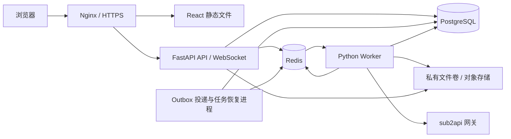

# 项目架构

状态：设计方案，尚未实现。本文基于当前 screen2code 和相邻 sub2api 源码；不代表已验证生产环境接口。

版本：1.2，更新日期：2026-09-18。本文为实施与上线验收依据；第 10 节起将前述设计细化为确定的实现约定，第 19 节明确统一登录和无感计费开通。文中的新增文件、配置和命令均为待实现目标，不能当作当前已具备的功能。

稳定性的交付标准是：所有权约束、任务状态和故障处置有明确实现；通过真实数据库/Redis 故障注入与恢复演练后才上线。单台服务器不具备主机级高可用，且外部模型调用无法仅靠本系统保证绝不重复计费，不能作零故障承诺。

## 1. 目标与范围

保留现有 React + FastAPI 单体代码仓库，实现统一账号密码登录、个人项目和文件隔离、后台生成任务、断线恢复，以及使用后台自动配置的用户专属 sub2api Key 调用模型并计费。无需为每个用户部署一份应用，也无需拆成微服务。

正式方案：sub2api 为唯一用户身份和账务来源。用户只需在统一登录页输入账号密码，已登录则直接进入；后台自动创建本地用户映射和应用专属 Key，不要求用户填写 Key、用户 ID、分组或中转地址。首版由管理员在 sub2api 开通账号，不开放 screen2code 独立注册。当前上游支持邮箱密码，若要求任意用户名登录需单独扩展上游认证；邮箱作为登录账号不意味着新增邮箱验证步骤，已有安全策略仍须遵守。

## 2. 当前代码与改造原因

| 位置 | 已确认现状 | 改造 |
| --- | --- | --- |
| `backend/routes/generate_code.py` | `/generate-code` WebSocket 接收参数并直接执行 pipeline；上下文持有 WebSocket | 分离请求、执行与事件发送，执行迁至 Worker |
| `backend/config.py` | 普通生成默认 4 个 variant，视频 2 个；更新流程另有 2 个 variant 设置 | 按任务和模型调用两层控制并发；首版默认 1 个 variant |
| `frontend/src/generateCode.ts` | 连接建立即提交生成，连接关闭影响完成/取消判断 | HTTP 提交任务；WebSocket 只订阅事件，任务终态以服务端为准 |
| `frontend/src/store/project-store.ts` | 项目内容存于 Zustand 内存 | 数据库保存项目、版本及结果，浏览器状态作为缓存 |
| `backend/routes/design_systems.py` | 共用数据目录下的文件 | 改为带所有者的数据库记录 |
| `backend/routes/agent_runs.py`、`prompt_reports.py` | 暴露运行记录、内容、附件和清理接口 | 普通用户仅能操作自己的记录；全局清理仅管理员 |
| `backend/uploaded_assets/store.py` | `/local-assets` 直接挂载 StaticFiles，临时素材也使用公共目录 | 私有文件存储、所有权查询和授权下载 |
| `backend/main.py` | CORS 允许所有来源，当前路由未接入统一登录机制 | 同域部署、精确来源配置，统一 HTTP/WS 认证 |

不同浏览器的内存状态并不是同一个项目，但服务器资源及部分文件是共享的。问题是缺少持久化的用户归属和后端授权，不是单体架构本身。

## 3. 部署结构



- API 与 Worker 使用同一后端镜像、不同启动命令，共享业务模块；API 不执行耗时生成。
- PostgreSQL 是任务状态、项目和最终结果的事实来源。SQLAlchemy 2 + Alembic 管理模型和迁移。
- Redis 配合异步任务库 ARQ 调度，适配现有 asyncio 生成流程；不自行实现一套 List 队列消费框架。锁定版本后验证其重投、取消、超时和并发语义。
- Redis Streams 保存短期增量事件，供重连回放。不能仅用 Pub/Sub，因为离线期间事件会丢失。
- 单机首版使用私有持久文件卷；扩容时换 S3 兼容存储。不要把 base64 图片、完整代码或 Key 塞进 Redis 任务参数。
- 可复用已有 PostgreSQL/Redis 实例，但使用独立数据库/角色以及 Redis ACL 和 key 前缀，不直接访问 sub2api 内部业务表。Redis 逻辑 DB 不是安全隔离边界。

## 4. 登录与授权

普通用户密码仅由 sub2api 管理，screen2code 不保存或转发用户密码，通过一次性授权码交换可信身份并签发本地 session。用户名和邮箱仅作展示，不作为跨系统匹配依据。本地运维应急账号使用 Argon2id、交互式 CLI 和独立审计，默认无模型消费权限，不提供普通用户本地登录旁路。

登录成功签发高熵随机 session，数据库仅保存其哈希、用户、过期时间和撤销时间。浏览器使用 HttpOnly、Secure、SameSite=Lax Cookie；生产统一域名代理 `/api` 和 `/ws`。修改操作校验 CSRF token 和 Origin；WebSocket 握手校验 Cookie 与 Origin。登录按 IP 和账号组合限速，失败提示不泄露账号存在性。

所有资源从会话取得 user_id，禁止相信客户端传入的 user_id。读取、修改、删除、下载、订阅和取消任务都必须带所有者条件；跨用户资源统一返回 404。UUID 只能降低猜测概率，不能替代授权。

退出和禁用账号撤销 session；长连接周期性复查会话，过期或撤销即关闭。用户切换时清理 Zustand、事件订阅和浏览器缓存，防止同一浏览器显示前一用户的数据。

旧版生成、评测、导出、截图、日志、素材路径全部纳入路由权限审计：可执行模型调用的旧入口必须删除、禁用或转入相同队列，不得保留绕过计费与限流的通道。截图和导出涉及服务端抓取时应拦截内网、环回及云元数据地址，并对 DNS 和每次跳转复查。

## 5. 数据模型

| 表 | 核心字段/约束 |
| --- | --- |
| users | id、display_name、role、status、created_at；普通用户无 password_hash，外部身份是唯一登录依据 |
| sessions | token_hash UNIQUE、user_id、expires_at、revoked_at |
| external_identities | user_id、issuer、subject、auth_version、last_verified_at；UNIQUE(issuer, subject)，由服务端验证后自动创建 |
| gateway_credentials | id、user_id、encrypted_key、key_version、fingerprint、status；只返回掩码 |
| projects | id、user_id、name、head_revision_id、version、created_at、updated_at |
| revisions | id、user_id、project_id、parent_revision_id、task_id、variant_index、code_storage_key、model |
| assets | id、user_id、project_id、storage_key、mime_type、size、checksum |
| generation_tasks | id、user_id、project_id、credential_id、input_snapshot、status、idempotency_key、request_hash、attempt、lease_token、lease_until、cancel_requested_at、error_code、timestamps |
| task_attempts | id、task_id、attempt、stage、upstream_started_at、upstream_request_id、usage、outcome |
| outbox | id、task_id、event_type、published_at、attempts、next_attempt_at |
| design_systems | id、user_id、name、content、timestamps |

任务幂等约束为 UNIQUE(user_id, idempotency_key)。同一 key 和同一请求返回原任务，不同请求返回 409。关联资产、凭据、父版本和设计系统必须属于同一个用户；通过服务层校验和必要的复合外键共同保证。

input_snapshot 是服务端校验后的不可变参数快照，包含素材引用、模型配置、variant 数和父版本；不包含明文 Key。项目保存使用 version 乐观锁，同一项目同时编辑返回冲突。任务完成总是追加版本，仅在 head 未改变时自动更新，避免旧任务覆盖较新的修改。

Key 使用可轮换的应用加密密钥加密保存，加密密钥由服务端 secret 注入，不放入数据库或 Git。Worker 在执行时读取凭据并校验状态；账号禁用或 Key 撤销后不能启动新调用。日志、异常、模型 tracing 和任务记录必须脱敏。

## 6. 任务提交、队列与恢复

1. `POST /api/projects/{id}/tasks` 验证身份、项目/素材归属、大小、模型白名单及用户队列配额。
2. 在一个数据库事务中创建 queued 任务和 outbox 事件；返回 202、task_id 与状态地址。配额检查需要锁或原子计数，避免并发提交绕过限制。
3. Dispatcher 将 outbox 投递到 ARQ，使用 task_id 与 attempt 生成稳定 job id，确认后标记已投递。即使投递后进程崩溃，重复投递也不能再次执行同一 attempt。
4. Worker 通过数据库条件更新领取任务，写入租约和 fencing token；同一任务仅一个有效执行者。执行前再次检查取消、用户和凭据状态。
5. Worker 运行与 WebSocket 无关的生成服务，通过 EventSink 写入 Redis Stream。原有 chunk、thinking、toolStart、toolResult、setCode 等事件尽量保留。
6. 代码和必要输出先保存到私有存储，再事务提交版本与任务终态，最后发送完成事件。数据库成功但事件发送失败时，前端仍能从任务接口取得结果。
7. Worker 心跳续租；恢复进程处理长期 queued 任务、未投递 outbox 和租约过期任务。Redis 丢失后从数据库重建待处理任务。

建议状态：queued → running → succeeded / partially_succeeded / failed / interrupted；queued 可以直接 cancelled，running 可进入 cancel_requested，再由 Worker 确认 cancelled。所有终态写入校验 lease_token，阻止旧 Worker 覆盖新执行状态。

取消接口是幂等操作。取消与开始/完成采用条件更新解决竞争：已完成任务返回其终态；取消被接受后 Worker 停止后续模型/工具调用并尽力关闭当前上游请求。取消不能保证上游尚未产生费用。浏览器断开只停止订阅，不等于取消任务。

Redis 配置持久卷、AOF 和 noeviction；事件 TTL 与任务队列 key 分开管理，不误删运行任务。ARQ 的自动重跑不能等同于业务允许重试，执行入口必须检查数据库阶段和尝试记录。

### 重试与计费边界

模型调用不具备已验证的跨系统 exactly-once 保证。SDK 的隐式重试也需审计：一旦请求可能已被上游接受，超时、断连或 Worker 崩溃后，不得直接重跑整个任务。

- 可证明未调用上游的失败：有限次数自动重试，并带退避。
- 请求发送后结果不明：标记 interrupted，提示用户可能已经计费，保留已生成结果；用户明确重试时创建新任务并关联原任务。
- 成功模型返回但结果保存失败：优先恢复已有持久化输出，不能再次调用模型以“补写”。
- 多 variant 部分成功：保留成功版本，不自动重跑全部版本。
- sub2api 若后续提供并验证幂等请求或结果查询协议，再增加自动恢复能力；自定义 request-id 仅用于追踪，不能假设它防止重复扣费。

### 初始限额（配置项）

每用户运行 1 个任务、等待最多 3 个，全局运行 2 个，默认 1 个 variant，任务超时 10 分钟，事件保留 24 小时。数值是起点，需要根据模型耗时和服务器资源压测调整。

ARQ 的进程 max_jobs 不能作为多 Worker 的全局上限。全局并发采用数据库 execution_slots 与租约，用户并发采用用户调度行锁和部分唯一索引，并有过期恢复；模型调用并发单独限制，避免 2 个任务 × 4 个 variant 放大成至少 8 路调用。繁忙用户的任务延迟调度，不能占住 Worker 等待名额。Chromium 工具另设较低并发与资源上限。

## 7. 流式输出与前端

- `GET /api/auth/sso/start`、`GET /api/auth/sso/callback`、`POST /api/auth/logout`、`GET /api/auth/me`；不提供普通用户密码登录接口。
- `GET/POST /api/projects`，项目详情、重命名、删除及版本接口。
- `POST /api/projects/{id}/tasks`、`GET /api/tasks/{id}`、`GET /api/tasks`、`POST /api/tasks/{id}/cancel`。
- `/ws/tasks/{id}?after=<stream-id>` 只订阅已存在且属于当前用户的任务。
- `POST /api/assets`、`GET /api/assets/{id}`、`GET /api/account/service-status`；不提供用户手动配置凭据的接口。

事件携带 task_id、单调游标、variant_index、type 和 payload。每个浏览器订阅独立读取 Stream，不能使用会把事件分摊给不同浏览器的同一个 consumer group。断线重连携带游标，前端去重；事件过期则获取数据库结果快照，服务端明确通知 reset，不伪装成完整回放。

页面提供登录、项目列表、生成编辑器和个人任务列表，任务显示等待、执行、取消、失败与完成。刷新后从数据库恢复任务及结果；队列长度可展示，精确等待时间无法保证。完成以任务终态为准，不以 WebSocket close 为准。

预览生成的 HTML 使用隔离来源或严格 sandbox，不能与登录应用共用具有访问父页面权限的执行环境。模型读取私有图片优先通过服务端读取字节传入；确需 URL 时签发限资源、限用途、短期下载链接。不能依赖模型请求携带用户 Cookie，也不能重新开放整个静态目录。

## 8. sub2api 集成与费用归属

本地源码已确认 `backend/internal/server/routes/gateway.go` 注册 `/v1/chat/completions`、`/v1/responses`、`/v1/messages`；`gateway_key_billing.go` 提供 `GET /v1/sub2api/billing`。该接口返回 Key 的 token 费率倍率，不是余额、扣费接口或任务账单。

调用链：sub2api 统一登录 → 自动映射本地用户 → 后台幂等开通该用户的应用专属 Key → 所属任务 → 固定 sub2api 网关 → sub2api 鉴权、限额及计费。

第一版使用服务端配置的 OpenAI 兼容网关地址与白名单模型，优先打通截图到代码。现有 agent 使用的工具调用、流式响应和多模态输入需要真实网关契约测试，不能仅以普通聊天成功判断兼容。Anthropic、Gemini、视频及 Replicate 图片工具逐项接入；未接入的供应商路径在托管模式禁用，不能回退到共享环境 Key 绕过用户计费。

前端不允许提交 base_url、provider Key、credential_id 或 sub2api 用户 ID。应用专属 Key 仅在服务器之间传输并加密保存，普通用户界面不提供 Key 输入或查看入口。不同 sub2api 用户对应各自的应用专属 Key，账务按 sub2api 账户/订阅规则处理；同一用户在多个应用的消费可以共用其账户余额，不误称为每个应用独立钱包。

账号密码登录和网关 Key 是两种凭据。当前 sub2api 的 LoginRequest 使用 email/password，并不直接提供任意用户名登录契约。正式版必须完成第 19 节的 SSO 和凭据自动开通，不能以本地密码登录或手动填 Key 代替。身份按可信 issuer + subject 自动映射，不按同名用户名或邮箱合并。

screen2code 保存任务和每次模型调用的 usage、模型、时间及可获得的上游 request_id 作为追踪信息，不另做余额扣款。实际费用以 sub2api 账单为准；一个任务可能包含多轮 agent 调用和多个 variant。若需展示准确任务金额，需要后续验证 usage 查询及跨调用关联协议，不能使用费率接口推算后冒充实扣金额。

## 9. 实施顺序与验收

1. 建立数据库迁移、统一 SSO、自动身份映射、登录会话、统一授权和私有素材访问；关闭无授权旧入口。验收用户 A 无法读取、修改、导出或订阅用户 B 的任何资源。
2. 项目、版本、设计系统和日志按用户落库；旧共享数据只能由管理员显式指定归属，不能自动分给首个登录用户。验收刷新、退出再登录及换设备后恢复。
3. 将 pipeline 提取为 GenerationService(params, context, event_sink)，context 包含 user_id、task_id、凭据引用、取消信号及工作目录，不包含 WebSocket；接入 ARQ、outbox、Worker、租约和事件回放。
4. 更新前端提交/订阅/取消流程，增加任务状态与项目恢复。验收断网不终止生成、重连不重复提交、重复请求只生成一个任务。
5. 接入 sub2api 统一身份、专属 Key 自动开通和固定网关，验证多模态和 agent 工具调用；核对上游费用归属，不测试真实消费时明确使用 mock。
6. 增加生产 Compose、HTTPS 反向代理、健康检查、迁移作业和备份流程；数据库及文件卷一起备份，Redis 不作为唯一结果存储。

必须覆盖：越权下载/订阅、过期会话、CSRF、并发配额、幂等键冲突、Redis 故障、重复投递、Worker 调用前/调用后崩溃、取消竞争、部分 variant 失败、Key 撤销、上游余额不足、生成 HTML 的来源隔离。

按项目要求，代码修改后执行 `backend: poetry run pytest`、`backend: poetry run pyright`；涉及前端执行 `frontend: pnpm lint`，区分已有问题与新增问题。队列与事务可靠性另使用真实 PostgreSQL/Redis 集成测试，不能只用 mock 验证。

本文件仅描述设计，未修改运行代码、部署或数据库，也未执行上述功能验收。

## 10. 实现边界与模块清单

首版固定采用 PostgreSQL + SQLAlchemy async/asyncpg + Alembic、Redis + ARQ、Argon2id、cryptography AEAD 加密。依赖加入 Poetry 并提交 lock 文件，CI 使用同一锁文件。数据库任务租约是唯一执行权来源，Redis 只负责投递和事件；不再同时维护另一套 Redis 执行权信号量。

| 待新增或改造模块 | 职责 | 禁止事项 |
| --- | --- | --- |
| `backend/db/`、`backend/migrations/` | 模型、事务、连接池、迁移 | Web 启动时自动执行破坏性迁移 |
| `backend/auth/`、`backend/routes/auth.py` | SSO、session、CSRF、依赖注入、身份状态复查 | 将客户端 user_id 当作身份 |
| `backend/repositories/` | 按用户过滤项目、版本、素材、任务 | 普通接口调用无所有者条件的 get-by-id |
| `backend/services/generation.py` | 提取现有生成 pipeline；接收明确上下文 | 引用 WebSocket、全局当前用户或全局当前 Key |
| `backend/services/gateway.py` | 固定网关、白名单模型、凭据解密、调用记录 | 回退共享 Key、接受用户指定网关地址 |
| `backend/jobs/worker.py` | ARQ WorkerSettings、心跳、取消、结果提交 | 仅依赖 ARQ job id 防止重复执行 |
| `backend/jobs/dispatcher.py` | outbox 投递、过期租约扫描、调度恢复 | 持有数据库事务等待模型返回 |
| `backend/services/events.py` | Redis Stream 写入与读取、事件降级 | 无限缓存 token 或将消费者组用于广播 |
| `backend/services/storage.py` | 授权文件访问、原子写入、校验、垃圾回收 | 直接拼接客户端路径或公开私有卷 |
| `backend/cli.py` | 运维应急账号、数据归属迁移、集成状态诊断 | 创建普通用户密码旁路、输出完整 Key |
| `frontend/src/services/` | 带 Cookie/CSRF 的统一请求、任务订阅 | localStorage 保存密码、Key、session |
| `frontend/src/pages/` | 登录、项目、任务、个人配置 | 仅靠隐藏按钮实现权限 |
| `docker-compose.production.yml`、`deploy/` | 生产服务、代理、备份、运行手册 | 生产运行 Vite dev server 或 Uvicorn reload |

业务模式统一为托管模式，旧本地无认证模式不与其共用公开路由。保留开发兼容能力时必须显式启用，生产启动检查拒绝该开关。现有评测接口首版仅管理员可用或不注册，评测中的模型调用同样经过任务服务。

## 11. 数据库约束和事务落地

### 11.1 类型、索引与数据生命周期

- 主键 UUID，时间使用 `timestamptz` 并以 UTC 保存；状态用 CHECK 约束，JSON 使用 JSONB。金额如需保存使用 NUMERIC，不用 float 表示实扣金额。
- projects、assets、revisions、gateway_credentials 建立 `UNIQUE(user_id, id)`，关联方通过复合外键约束用户归属。版本引用项目同时校验 project_id，不能只校验相同用户。
- 索引至少包括 `projects(user_id, updated_at DESC, id)`、`generation_tasks(user_id, created_at DESC, id)`、`generation_tasks(status, lease_until)`、`assets(user_id, project_id)`；outbox 对待投递记录建立部分索引。
- 列表采用游标分页，默认 20、最多 100 条，不返回完整代码或日志；输出通过单独受保护接口读取。
- 项目和账号先软删除并阻止新任务；存在非终态任务或保留期内账单关联时不级联物理删除。后台 GC 只清理已无引用且过宽限期的对象。
- 幂等记录首版保留 30 天；任务清理后仍留幂等墓碑，避免旧客户端重发造成第二次消费。超出保留期的旧请求不承诺幂等。
- 增加 `provider_calls`：id、task_id、attempt、variant_index、call_index、credential_version、model、state、upstream_request_id、usage、started_at、finished_at；`UNIQUE(task_id, attempt, variant_index, call_index)`。一个 attempt 中的多轮调用不能挤在一条 task_attempts 记录里。
- 增加 `execution_slots`：id、kind、task_id、lease_token、lease_until，kind 区分任务、模型调用和浏览器工具。首版分别预建 2、2、1 个 slot；数据库控制跨 Worker 总并发。

### 11.2 提交事务

1. 从 session 得到用户，锁定该用户的调度行（可先使用 users 行），查找幂等记录。已存在且请求哈希一致立即返回原任务，不重复计算配额。
2. 校验项目 version、素材归属、凭据版本、账号状态及参数，计算规范化请求哈希。哈希包括项目、父版本、素材校验和、模型、prompt 和 variant 数，不包含秘密。
3. 用户等待任务数达到 3 返回 429；全局排队数达到配置上限返回 503。全局限制通过独立容量行串行检查，不能用无锁 COUNT 冒充原子限制。
4. 同一事务插入 task 和 outbox，提交之后才返回 202。数据库不可用时返回 503，绝不先提交 Redis 再“尽力”补数据库。

Redis 故障时允许数据库限额内接收 queued 任务，响应说明正在等待调度；超过限额立即拒绝。Redis 故障不允许旁路同步调用模型。

### 11.3 投递与领取事务

Dispatcher 用 `FOR UPDATE SKIP LOCKED` 分批领取 outbox，写入短期投递租约并提交；事务外投递 Redis，然后按租约确认发布。不同 Dispatcher 可以并行，重复投递由数据库领取门禁兜底。对队列 job id 附带 attempt；outbox 保留恢复所需记录，已发布不代表任务一定执行成功。

Worker 按固定锁顺序领取：用户调度行 → 任务行 → 空闲 slot。检查任务是 queued、attempt 匹配、用户无运行任务、没有取消请求，随后分配递增 fencing token 和租约。数据库部分唯一索引额外约束同一用户最多一个 running/cancel_requested 任务。领取失败直接返回或延迟投递，不占用 Worker 空等。

首版调度按用户轮转取最老任务；每轮每用户最多投递一个可运行任务，避免某用户占满 FIFO 队列。具体优先级暂不开放给客户端。

### 11.4 执行期间的事务边界

租约初值 60 秒，每 10 秒续约，恢复扫描每 10 秒执行，时间均取数据库时钟。每次模型/工具调用开始前验证租约、取消、用户状态及凭据版本；每次输出提交都校验 fencing token。

发起上游请求之前，先提交 provider_calls 的 `dispatching` 标记。此标记之后即使还没有收到 HTTP 响应，也按“可能已消费”处理。进程如果在标记后、发送前崩溃，会保守地中断任务，这是避免误重试的明确取舍。

数据库不可用或续租失败时停止发起新调用，尽力中止当前调用；旧 Worker 不再有权提交结果。租约和 fencing 只能保护本地写入，无法撤销上游已接受的请求。存在 dispatching/streaming 未决调用时，任务转 interrupted，不重新执行；模型 slot 进入隔离期，直到确认原执行已结束或达到上游超时与宽限期，防止租约一过期便实际超额调用。

### 11.5 结果提交和文件原子性

每个 variant 使用由 task_id、attempt、lease_token、variant_index 推导的不可变输出路径。文件先写临时文件、flush/fsync，再原子 rename；完成 manifest 记录校验和、模型、任务和完整性。生成成功且清单落盘后，再在数据库事务中插入版本和更新任务终态。

数据库提交失败时只重试该结果提交，不重跑模型。恢复进程只接收校验通过、对应 attempt 和有效执行记录的完整 manifest；部分 token 只能作为草稿，不能当作已完成结果。数据库中没有引用的孤立文件保留至少 24 小时后回收。

Key 修改采用新增不可变版本，任务引用提交时的版本；默认撤销旧版本后其等待任务失败为 `credential_revoked`，不悄悄换新 Key 扣费。主加密密钥轮换通过 key_version 逐条重加密，并保留旧解密密钥直到迁移和备份恢复验证结束。

## 12. 状态机与异常处置表

| 当前状态/事件 | 下一步 | 是否自动重新调用模型 |
| --- | --- | --- |
| queued，收到重复 job | 只有成功领取者进入 running | 最多一个领取者启动 |
| queued，用户取消 | 条件更新 cancelled；残留 job 后续直接退出 | 否 |
| running，全部 variant 成功 | 原子保存版本，succeeded | 否 |
| running，部分 variant 成功 | 保存成功结果，partially_succeeded | 否 |
| running，上游明确拒绝 Key/余额/模型 | 保存错误，failed | 否 |
| running，超时/断流，曾记录 dispatching | 保留输出，interrupted | 否 |
| running，租约丢失，但没有任何可能发送的调用 | 恢复为 queued，attempt + 1，创建新 outbox | 最多重试 2 次 |
| running，接受取消 | cancel_requested；停止后续步骤，终止本地调用后 cancelled | 否 |
| cancel_requested，Worker 消失 | 租约失效后回收为 cancelled；记录费用可能已产生 | 否 |
| 结果清单完整，数据库未提交 | 验证清单后补交结果 | 否 |
| Redis 故障，任务正在运行 | 保持执行与数据库心跳，停止实时输出或有界缓冲 | 不因事件失败而重跑 |
| 数据库故障 | API 写入返回 503；Worker 停止新调用，按租约规则收敛 | 否 |
| 私有卷写满 | 拒绝新任务；当前任务尝试保留已有输出并告警 | 否 |

终态不可重新改成 running。用户点击重试会创建新 task_id，附带 retry_of_task_id，并明确显示可能再次产生费用。自动重试采用 5 秒、20 秒加随机抖动，只针对可以证明尚未调用上游的任务。

取消和完成争用同一任务行：完成先提交则取消返回现有终态；取消先提交则完成不能覆盖 cancelled/cancel_requested，已有结果可以作为明确标识的部分输出保留。SDK 自动重试首版关闭，由本系统决定是否重试。

## 13. API 契约和客户端恢复

### 13.1 提交示例

```http
POST /api/projects/{project_id}/tasks
Idempotency-Key: <客户端每次新生成动作创建的 UUID>
X-CSRF-Token: <会话对应的 token>
Content-Type: application/json

{
  "project_version": 3,
  "parent_revision_id": null,
  "asset_ids": ["<asset_uuid>"],
  "prompt": "将截图还原为页面",
  "model": "<服务端允许且已验证的模型>",
  "variant_count": 1
}
```

```json
{
  "task_id": "<task_uuid>",
  "status": "queued",
  "status_url": "/api/tasks/<task_uuid>",
  "events_url": "/ws/tasks/<task_uuid>",
  "dispatch_delayed": false
}
```

首次成功返回 202；幂等重放返回原任务及当前状态。请求体丢失响应时必须复用同一幂等键，不能生成新键重发。没有拿到 task_id 的前端可用自己的幂等键查询 `GET /api/tasks/by-idempotency-key/{key}` 恢复，仅限当前用户。

统一错误体为 `{"error":{"code":"...","message":"...","request_id":"..."}}`；401 登录失效，403 CSRF/禁用账号，404 不存在或非本人资源，409 项目版本或幂等冲突，413 超限，422 参数非法，429 用户配额/限流，503 基础设施不可用。429/503 给出 Retry-After，但前端重发仍复用原幂等键。

### 13.2 登录与凭据默认值

普通用户账号、密码策略和必要的二次验证由 sub2api 统一管理，screen2code 不另行定义用户名和密码规则。Session 固定最长 7 天；本地退出立即撤销，跨系统密码重置/账号禁用按第 19 节事件与状态复查传播，不能承诺网络故障时瞬时同步。管理操作回到统一身份源重新认证。

Cookie 命名 `__Host-screen2code_session`，Path=/、无 Domain、HttpOnly、Secure。CSRF token 从登录响应或会话接口获得并仅存内存。WS 每 30 秒复查会话，每用户最多 5 个连接；会话撤销传播目标不超过 35 秒。

### 13.3 增量事件

Stream key 为 `s2c:events:{task_id}:{epoch}`，epoch 保存于数据库。事件包括 stream_id、task_id、epoch、type、variant_index、payload。任务每次开始新的执行 attempt 或 Redis 数据丢失后更换 epoch；客户端收到不同 epoch 或过期游标时先 reset，再获取快照，避免将不同流的 token 拼接。

chunk 按 100 毫秒或 4 KiB 合并，每事件上限 64 KiB，每任务 Stream 最多约 10,000 条；截断和过期均必须返回 reset。活跃任务刷新 TTL，终态后保留 24 小时。Stream 用于短期回放，不用于长期审计或账单。

WS 订阅使用 XREAD，每个连接独立游标，鉴权完成后才读取。慢客户端发送缓冲上限 1 MiB，超过则断开并要求恢复，不无限占用服务器内存。Redis 暂不可用时前端以 2-10 秒抖动退避轮询任务状态；任务运行中可以没有实时 token，完成后仍能取得持久化结果。

前端每 10 秒并在 WS 关闭时核对任务状态，避免最后完成事件丢失后一直显示运行中。任何 reconnect 都只订阅，不再次提交生成请求。

## 14. 资源限制和生产配置

以下均为待新增配置，生产启动时验证类型、范围和必填项。缺少数据库地址、加密密钥、固定网关或可信来源时拒绝启动，不能退回无认证默认值。

| 配置 | 初始值/要求 |
| --- | --- |
| `DATABASE_URL` | 独立 PostgreSQL 数据库及最小权限业务角色，通过 secret 注入 |
| `REDIS_URL` | 独立 Redis/ACL 凭据，内网访问 |
| `APP_ORIGIN` | 唯一正式 HTTPS 来源 |
| `SUB2API_BASE_URL` | 运维固定配置，启动探测时不输出 Key |
| `CREDENTIAL_ACTIVE_KEY_ID`、`CREDENTIAL_KEYRING_FILE` | 活跃密钥版本和挂载密钥文件 |
| `PRIVATE_STORAGE_ROOT` | `/data/screen2code`，与 Web 静态根分离 |
| `GLOBAL_TASK_CONCURRENCY` / `GLOBAL_MODEL_CONCURRENCY` | 2 / 2，数据库 slot 控制 |
| `PER_USER_TASK_CONCURRENCY` / `PER_USER_QUEUED_LIMIT` | 1 / 3 |
| `GLOBAL_QUEUED_LIMIT` | 100；达到上限拒绝新任务 |
| `MAX_VARIANTS` / `BROWSER_CONCURRENCY` | 1 / 1，后续基于压测增加 |
| `TASK_TIMEOUT_SECONDS` | 600，总超时覆盖 agent 多轮调用 |
| `LEASE_SECONDS` / `HEARTBEAT_SECONDS` | 60 / 10 |
| `UPSTREAM_CONNECT_TIMEOUT_SECONDS` | 10 |
| `UPSTREAM_IDLE_TIMEOUT_SECONDS` | 90；总调用截止时间不超过任务剩余时间 |
| `UPLOAD_MAX_BYTES` / `TASK_MAX_ASSETS` | 单文件 10 MiB / 每任务 5 张 |
| `IMAGE_MAX_PIXELS` / `MAX_PROMPT_CHARS` | 25,000,000 / 20,000，防止解码炸弹和超长请求 |
| `EVENT_RETENTION_SECONDS` | 86400，另设条数限制 |

初始容量规划以单机 4 vCPU、8 GiB 内存、SSD 为压测基线，不作为容量保证；sub2api 与其同机时重新测算。Redis 可先分配 512 MiB maxmemory，容器限制需额外预留 AOF 重写和进程开销；达到内存限制时返回错误而非淘汰队列。PostgreSQL 连接池初值每进程 pool_size=5、max_overflow=5，按 API/Worker/Dispatcher 进程总数核算连接预算。

所有 SDK、HTTP 和浏览器调用均须设置超时。Playwright 运行在非 root 的受限 Worker 中，限制 CPU、内存、进程数和外网访问；浏览器页面内的子资源请求也必须受网络策略约束，不能只校验用户最初输入的 URL。上传只接受已验证 MIME/解码成功的图片；首版视频功能关闭。

私有资产总量设用户配额，默认 1 GiB；上传时预留容量，失败释放，不能仅依赖异步统计。生成代码、日志、预览文件也计入可配置的项目存储上限。磁盘剩余低于 20% 告警、低于 10% 暂停接收任务，GC 不能删除非终态任务引用的数据。

## 15. 部署、发布与回滚步骤

### 15.1 服务组成

生产 Compose 包含 proxy、api、worker、dispatcher、postgres、redis，以及一次性 migrate 服务。前端通过构建后的 dist 由 proxy 提供；仅 proxy 暴露 80/443。数据库、Redis 和后端端口不对公网开放。API、Worker 与 Dispatcher 使用相同镜像 digest，挂载同一私有卷；API 对生成输出尽量只读，上传路径单独可写。

PostgreSQL 和 Redis 选择仍受支持且兼容的稳定版本，实施时锁定补丁版本/digest，并记录 ARQ Redis ACL 所需命令与 key 模式。不能在未压测的情况下自动升级基础设施或 Python SDK。

### 15.2 健康检查

- `/health/live`：只检查进程能响应，不调用模型，不暴露配置。
- `/health/ready`：检查数据库和 schema 版本；读写 API 不可用则 503。Redis 故障但数据库仍能限额接收任务时返回可服务且标记 degraded，详细原因仅内网可读。
- Worker heartbeat：Dispatcher 监控最后心跳；60 秒无可用 Worker 告警并标记调度退化。
- 启动顺序：数据库/Redis 就绪 → 单次迁移成功 → API/Dispatcher/Worker → proxy 切流。迁移失败停止发布。

### 15.3 实施后目标命令

以下命令依赖本方案新增的文件与模块，目前不能直接运行：

```bash
docker compose -f docker-compose.production.yml config --quiet
docker compose -f docker-compose.production.yml up -d postgres redis
docker compose -f docker-compose.production.yml run --rm migrate
docker compose -f docker-compose.production.yml run --rm api poetry run python -m cli check-sub2api-integration
docker compose -f docker-compose.production.yml up -d api dispatcher worker proxy
docker compose -f docker-compose.production.yml ps
```

服务内部启动目标分别是 `poetry run uvicorn main:app --host 0.0.0.0 --port 7001`、`poetry run arq jobs.worker.WorkerSettings`、`poetry run python -m jobs.dispatcher`、`poetry run alembic upgrade head`。首版 API 使用一个进程，扩容前检查总连接池和数据库 slot 不随进程数错误放大。

### 15.4 发布与回滚

1. 记录镜像 digest、schema 版本、配置版本和依赖版本；完成数据库及文件卷备份。
2. 进入维护状态：停止新提交和新的 Worker 领取，已有任务最多等待 10 分钟收尾；不能仅关闭 proxy 就认为后台已停止。
3. 超时任务按中断规则记录，再终止进程；容器 stop_grace_period 至少 90 秒，ARQ shutdown 行为通过集成测试确认。
4. 使用 expand/contract 迁移先增加兼容字段，单独迁移 job 执行；禁止在同次发布中立即删除旧字段。
5. 部署新镜像，运行登录、越权、提交、断线恢复和取消冒烟测试，再开放任务提交。
6. 失败时先关闭提交，恢复前一镜像；只有旧代码兼容当前 schema 才允许直接回滚。不要自动执行破坏性 downgrade；必要时按恢复流程还原备份并明确数据损失窗口。

生产禁止直接修改容器内代码。首次发布仅开白名单测试用户及并发 1，通过真实 Key 小额验收后逐步升到配置并发 2。

## 16. 备份、监控与故障运行手册

### 16.1 备份和恢复目标

首版目标：业务数据 RPO 不超过 24 小时、单机重建 RTO 不超过 2 小时，需实测确认。若业务不能接受一天数据损失，必须在上线前增加 PostgreSQL WAL/PITR 和对象存储版本控制，将 RPO 下调；不能把每晚备份描述成零丢失。

每天备份数据库、私有文件和加密密钥版本信息，保留至少 7 份日备份和 4 份周备份，异机加密存放。密钥备份单独授权并验证可解密，不把数据库与唯一密钥副本放在同一磁盘。备份需协调写入：首版在维护窗口暂停提交、排空任务、暂停 GC 和修改操作，再完成一致性备份；后续通过数据库快照和不可变对象设计消除长时间停写。

恢复顺序：建立隔离环境 → 恢复数据库/私有卷/密钥 → 校验文件引用及校验和 → 清空该应用的旧 Redis 队列命名空间并重建 → 不自动重跑任何可能已发出调用的历史任务 → 新建/恢复可信会话策略 → 验证用户隔离和结果可读 → 切流。旧 session 首版统一撤销，避免恢复已撤销凭据。

恢复备份还可能“复活”备份后已消费的任务，因此所有备份中的非终态任务先置为待核查的 interrupted；仅经调用记录/账单核对确认未消费的任务才允许重新排队。每月在隔离环境执行一次恢复演练，记录实际 RPO、RTO 和失败项。

### 16.2 监控指标

必须观测：API p95 延迟/错误率、排队数及最老等待时长、运行/中断/失败任务数、Worker 心跳、租约丢失、outbox 延迟、每用户和全局 slot 占用、Redis 内存/写入失败、数据库连接数/慢查询、磁盘余量、上游首 token 耗时/调用时长/状态码。

日志以 request_id、task_id、attempt、call_id 关联，user_id 只在受控结构化日志中使用；不能作为高基数监控标签。禁止记录 Cookie、Authorization、完整 Key、原始截图和完整 prompt，错误响应不返回上游敏感错误体。调试 tracing 默认关闭，启用时仍受用户归属和数据保留策略控制。

初始告警：outbox 延迟超过 60 秒、无 Worker 超过 60 秒、最老排队超过 5 分钟、Redis 内存超过 75%、磁盘可用低于 20%、5 分钟 API 5xx 超过 1%（至少 100 个请求）。上游失败与本系统失败分开统计。

### 16.3 运维操作顺序

| 故障 | 值班操作 |
| --- | --- |
| Redis 不可用/写满 | 检查内存与 AOF，恢复服务；确认数据库 outbox 自动补投；不得批量手动重跑 running 任务 |
| Worker 卡死 | 先关闭该 Worker 新领取，查 task/call 状态与租约，再重启；消费结果不明的任务保持 interrupted |
| PostgreSQL 不可用 | 暂停提交和新调用，恢复数据库；核对租约、完整 manifest 与未决调用后恢复调度 |
| 上游大面积 429/5xx | 降低并发、暂停新调用并告警；已消费不明任务不自动重跑，向用户显示服务退化 |
| Key 泄露 | 撤销本地凭据及对应等待任务，在 sub2api 撤销 Key；经运维明确重新授权后后台配置新版本，不让用户手动绑定 |
| 磁盘不足 | 暂停提交，清理过期无引用临时数据或扩容，校验输出可读后恢复；不删正在生成的文件 |
| 数据越权迹象 | 暂停相关资源接口、撤销会话、保留审计，修复并跑完整隔离用例后再开放 |

## 17. 分阶段执行清单与交付门槛

各阶段必须可独立评审；前一阶段验收未通过，不开放下一阶段的生产入口。

| 阶段 | 必须交付 | 通过条件 |
| --- | --- | --- |
| P0 基线 | 当前路由/外呼/存储清单，测试与 lint 基线，锁定依赖兼容性 | 列出所有可发起消费与读取用户文件的路径，无遗漏 |
| P1 身份与数据库 | Alembic 首迁移、sub2api SSO、自动身份映射、Cookie session、CSRF、统一授权 | 两用户 HTTP/WS/下载越权测试通过；授权码不可重放 |
| P2 持久化 | 项目/版本/素材/设计系统仓库、数据归属迁移命令、私有预览 | 重启和换设备可恢复；并发保存不会静默覆盖 |
| P3 生成服务拆分 | 独立 GenerationService、EventSink、固定网关适配器、mock 上游 | 原有截图生成和编辑逻辑通过回归，后台服务不依赖 WS |
| P4 队列与可靠性 | ARQ Worker、outbox、slot、租约、manifest 恢复、取消 | 重复投递/崩溃/Redis 清空/数据库故障测试通过 |
| P5 前端与计费联调 | 登录/项目/任务页面、恢复协议、应用 Key 自动开通与轮换 | 首登无手工配置、并发开通无重复 Key、两账户计费正确；真实 SSE/工具调用通过 |
| P6 生产准备 | Compose、HTTPS、告警、备份恢复、发布回滚手册 | 压测、故障演练、恢复演练和全部上线检查通过 |

## 18. 可重复验收与稳定性门槛

### 18.1 必测场景

| 测试 | 执行方式 | 必须满足 |
| --- | --- | --- |
| 数据隔离 | A/B 各建项目、素材、Key、任务；交叉替换所有资源 ID | 全部被拒绝，无内容和事件泄露 |
| 幂等竞争 | 同一用户相同 key 并发提交 50 次 | 数据库仅一条任务；mock 上游执行次数符合单任务调用数 |
| 全局/用户并发 | 多用户同时提交并启动两个 Worker | 全局任务≤2、单用户≤1、模型调用≤2；不因进程数翻倍 |
| 队列公平性 | 一用户排满，再让另一用户提交 | 后者在后续可用调度轮次得到机会，无无限饥饿 |
| 投递崩溃 | Redis 已接收后杀 Dispatcher，尚未标记 outbox | 恢复后任务执行一次或仍受领取门禁保护 |
| 调用前崩溃 | 领取后、provider_calls dispatching 前杀 Worker | 租约过期后可按限额重试，不丢任务 |
| 调用后崩溃 | mock 记录收到请求后杀 Worker | 不再次调用；任务 interrupted，费用未知有明确提示 |
| 结果写入窗口 | manifest 已落盘、数据库提交前注入故障 | 从清单补交结果，不重跑模型 |
| 取消竞争 | queued/running/提交结果时各并发取消 20 次 | 终态一致，无新调用越过已接受取消的检查点 |
| Redis 故障 | 生成中停止 Redis，恢复后重连 | 最终结果可获取，重连不重复提交，事件 reset 正确 |
| 数据库故障 | 调用过程中断开数据库 | 失去租约后无新调用、旧 Worker 无权覆盖终态 |
| 超时与慢客户端 | 上游不返回、WS 客户端不读取 | 超时生效、内存有界、任务不永久 running |
| 会话撤销 | 运行时退出或管理员禁用用户 | HTTP 立即失效，WS 在目标期限内关闭，新调用受限 |
| 计费归属 | 两个 sub2api 账户各用自己的 Key 生成 | 上游记录分别归属正确账户，禁止共享 Key 回退 |
| 恢复演练 | 从异机备份恢复全新环境 | 文件引用完整、Key 可解密、未决任务不自动再扣费 |

### 18.2 测试命令与基础设施

在 backend 目录使用项目 Poetry 环境运行 `poetry run pytest` 和 `poetry run pyright`，前端运行 `pnpm lint`、`pnpm build` 及适用的现有测试。集成测试新增独立 PostgreSQL/Redis 容器与测试数据目录，每次运行清理仅限专用测试实例，禁止使用生产 URL。

测试上游提供可控的 SSE、延迟、断流、工具调用、usage 和已接收请求计数；故障注入必须在明确的事务检查点执行，不能依赖随机 sleep 猜测窗口。真实 sub2api 联调用独立测试账号与低额度 Key，核对真实消费和工具协议，费用不明的中断不以 mock 结果代替。

### 18.3 发布阻断条件

1. 已有测试基线有记录；此次修改无新增测试失败、无 changed files 新增 pyright 警告、无新增 lint 错误，生产构建成功。
2. 所有隔离、幂等、取消、调用后崩溃和备份恢复用例通过，任何越权或可能自动重复消费问题都阻断上线。
3. 在约定硬件上进行 60 分钟负载测试：20 个登录用户、持续队列压力、全局并发 2；非流式读接口 p95 < 500ms、任务提交 p95 < 1s，排除故意拒绝请求后的系统 5xx < 0.1%。不把上游模型生成时间纳入 API 响应目标。
4. 进行 24 小时 mock 上游稳定性运行，包含多次 Redis/Worker 重启；无 OOM、无超过恢复窗口仍悬挂的任务、无持续内存增长。真实上游另测少量端到端样本，不用付费请求做整天压力测试。
5. 备份恢复达到声明的 RPO/RTO，监控告警能够实际触达运维，上一版本镜像与回滚步骤可用。

这些是上线前要验证的目标，并非当前已达成指标。若需要主机故障期间仍可用，第二阶段必须增加至少两台应用主机、共享对象存储、PostgreSQL 高可用和受控 Redis 故障切换，并再次验证租约、队列丢失恢复与费用不确定窗口；仅增加 Worker 数量不能实现完整高可用。

## 19. 无感登录与计费开通：正式接入协议

### 19.1 用户体验和身份权威

正常路径只有“打开应用 → 已登录直接进入，未登录输入统一账号密码 → 上传截图 → 生成”。用户不复制 Key、不绑定账号、不选分组、不配置地址；身份映射与计费凭据开通都是后台动作。首次开通短暂等待显示“正在准备工作区”，失败提供重试入口和错误编号，不要求用户手动补数据。

账号由 sub2api 管理员统一开通；不存在的账号不能在 screen2code 输入任意账号密码后自动创建。后续若开放注册，也由 sub2api 注册流程完成，再自动返回应用。已有 sub2api 的验证码、MFA 或账号风控必须遵守，不为“无感”绕过安全策略。

screen2code 不保存普通用户密码，也不在自己的页面代收 sub2api 密码。统一登录页可使用一致品牌，但凭据直接交给身份源。充值和消费明细跳转到配置好的 sub2api 页面，保留安全的返回路径；无感指无需技术配置，不代表免登录、免费使用或免充值。

### 19.2 已有能力与必须新增的能力

| 能力 | 本地源码证据 | 本方案使用方式 |
| --- | --- | --- |
| 统一登录 | `auth_handler.go` 的 email/password 登录 | 复用 sub2api 登录界面和安全策略 |
| 应用登录跳转 | `routes/auth.go` 注册 canvas/ppt/ju/livart start，`canvas_sso.go` 签发短时 ticket | 参考已有工程模式，新增 screen2code 专用协议；不假设现有 ticket 已满足本节要求 |
| 用户 Key 管理 | `routes/user.go` 实际注册 `/api/v1/keys` 和 `/api/v1/groups/available` | 内部复用 Key service 与分组权限校验；handler 中 `/api-keys` 注释不是实际路由 |
| 用户 Super Key | `/api/v1/keys/super` 调用 GetOrCreateSuperAPIKey | 不直接作为 screen2code 凭据，专用 Key 更便于应用级撤销和审计 |
| 自动开通的幂等/应用归属约束 | 尚未确认现有接口具备 | 必须新增应用集成 service、持久化关联和受限接口 |
| 单点撤销和状态查询 | 本次未验证完整跨应用协议 | 按本节新增并测试，不宣称现成可用 |

实现会涉及相邻 sub2api 仓库的认证路由、集成 service 和数据库迁移；不能只改 screen2code 前端就完成。本文尚未修改这两个项目的业务代码。

### 19.3 SSO 授权码流程

推荐使用后端兑换的一次性 opaque code，不把 API Key、用户 JWT、可读取个人信息的签名 payload 放入浏览器 URL。以下路由名称是待新增契约，实施时两端共同锁定。

1. 浏览器访问 screen2code `/api/auth/sso/start`。服务端生成随机 state、PKCE verifier/challenge 和登录事务，过期时间 5 分钟；事务绑定 HttpOnly 浏览器 Cookie，并保存允许的站内返回路径。
2. 跳转 sub2api 的应用授权页面。该页面复用现有登录状态；未登录先完成登录，然后通过已有 JWT 认证方式请求 `POST /api/v1/integrations/screen2code/authorize`。不能假设顶层页面跳转会自动携带 sub2api 的 Bearer JWT。
3. sub2api 校验登录主体、应用权限、精确注册的 redirect_uri 和 PKCE challenge，产生 60 秒有效的一次性 code，仅保存 code 哈希。code 绑定 subject、client_id、redirect_uri、PKCE challenge 和认证版本。
4. 浏览器回到 screen2code 固定 callback，携带 code 和 state。后端验证登录事务与浏览器绑定、state 和过期时间，通过服务端认证调用 `POST /api/v1/integrations/screen2code/exchange`，提交 code、verifier、redirect_uri。
5. sub2api 原子消费 code，返回固定 issuer、不可变 subject、展示资料、auth_version 和该应用的服务端授权句柄。screen2code 以 `UNIQUE(issuer, subject)` upsert 本地用户与身份，轮换本地 session，再启动凭据 ensure。
6. callback 成功后立即 303 跳转到无 code 的站内 URL。认证路由禁用缓存、设置 Referrer-Policy:no-referrer，代理/access log 不记录查询参数，回调页面不加载第三方资源。

code 被兑换后的网络响应若丢失，不重复使用 code 获取秘密，也不因此创建第二个用户；重新走 SSO。已有登录时无需再输入密码，数据库唯一约束保证映射不重复。SSO 身份交换不同时创建 API Key，使认证失败重试与凭据开通解耦。

禁止按邮箱自动合并旧本地用户。旧项目迁移由管理员预先提交并审核“旧 user_id → issuer/subject”映射，执行前备份并检查唯一性；用户不参与手动关联，无法确认的旧数据保持隔离。

### 19.4 服务端授权范围

集成客户端使用独立 client_id 和可轮换的服务端凭据，通过 TLS 调用；不得向 screen2code 发放通用管理员 Token。sub2api 必须同时校验应用身份与 exchange 签发的 subject 授权句柄，禁止只凭请求体 user_id 为任意用户创建 Key。

授权句柄是不透明、可撤销的高熵随机值：sub2api 保存哈希与 subject/client_id/scopes/status，screen2code 加密保存原值。权限仅包括该主体的 `credential:ensure`、`credential:status`、`credential:rotate`（受策略约束）和 `identity:status`，无充值、改余额、管理其他用户或修改分组权限。操作时重新检查账号、授权和分组资格；句柄不能仅靠“曾登录过”永久越权。

后台任务需要脱离浏览器 session 执行，因此用户本地退出只撤销本地会话，默认不取消已经提交的任务。上游账号禁用、应用授权撤销和凭据撤销则禁止新调用。首次 SSO 由 sub2api 的应用策略授权自动开通，不要求用户逐次确认 Key 管理。

### 19.5 幂等创建应用专属凭据

新增 `POST /api/v1/integrations/screen2code/credentials/ensure`，仅后端可调用。请求包含授权句柄、用途和服务端配置的 policy_version，不接受浏览器传入用户、分组、额度或自定义 Key。

sub2api 增加 `application_credentials` 表，至少包含 client_id、user_id、purpose、api_key_id、generation、policy_version、status、timestamps；`UNIQUE(client_id, user_id, purpose)`。API Key 创建与关联记录提交在 sub2api 同一个数据库事务内完成，锁定关联槽位；不能采用无锁的“列表查名字，没有就创建”。

ensure 必须满足：

- 已有 active 凭据：返回同一个 credential id、generation 和秘密；仅通过经过认证的服务端通道返回，Cache-Control:no-store。
- 首次开通：通过既有 Key service 校验用户与分组资格，创建普通应用专属 Key；原子写关联后返回。新增事务包装要确保 Key service 真正使用同一个事务连接。
- 请求超时或 screen2code 存储失败：重试 ensure 返回同一份凭据，不再创建新 Key。服务端必须支持安全重取当前秘密；若未来只保存哈希，需改用受限加密交付机制，不能假装能恢复原文。
- 已主动 revoked、blocked 或 Key 在管理端被删除：保留关联墓碑并返回 blocked；禁止 ensure 自动创建新 Key 绕过撤销。
- policy/group 不可用：返回明确不可用状态，不自动选权限更大的分组，不创建 Super Key，不回退公共 Key。

应用配置选择一个已验证的 OpenAI 兼容分组作为首版用途，必须属于当前用户可用范围。没资格的用户展示“当前账户暂不可使用此服务”，由运维处理；不向用户暴露分组配置。模型、额度和费率以 sub2api 为准，ensure 不给账户充值、不清空已用额度。

screen2code 增加 `billing_profiles`：user_id UNIQUE、identity_id、grant_ciphertext、remote_credential_id、credential_generation、status、last_checked_at、retry_count、next_retry_at、error_code；Key 密文仍放 gateway_credentials。状态为 pending/provisioning/ready/temporarily_unavailable/blocked。登录成功可以进入工作区，只有 ready 才允许生成。

开通任务可有限重试（1、3、10、30 秒加抖动），身份错误/撤销/无分组权限不自动重试。客户端只轮询 `GET /api/account/service-status`，返回 ready、preparing、temporarily_unavailable、blocked 等产品状态，绝不返回授权句柄、Key 或内部 subject。

### 19.6 入队、运行与凭据生命周期

提交任务时由后端从已验证的当前身份解析 billing_profile，并选择对应凭据版本，服务端写入 task.credential_id；未知的 credential_id/Key/base_url 请求字段直接拒绝。尚未开通时返回 `billing_preparing` 和 Retry-After，不创建占用生成配额的假任务；开通调用走独立轻量任务，不能与耗时生成共享全部 Worker 名额。

Worker 每次模型调用前检查本地账号和凭据状态，并根据最近的上游状态进行校验。网关自身每次请求执行最终鉴权、限额和扣费；本地余额预查不是余额预留，也无法保证排队期间仍有余额。

正常凭据轮换由受限 rotate 接口原子生成新 generation，并检查幂等键和 expected_generation；不能通过删除再 ensure 实现。新任务用新版本，旧版本最多允许既有任务在 15 分钟宽限期内收尾，期间保留原版本授权；泄露或管理员撤销则立即阻止旧版本新调用，等待任务终止为 credential_revoked。重试新任务时才解析新版本，不偷偷换 Key 重跑旧任务。

轮换后 Key 级剩余额度不得重置为完整初始额度：应用级累计上限须跨 generation 计算，或将剩余额度明确迁移并禁止旧新两代合计超支。该规则必须在 sub2api 侧事务执行；未实现前首版禁用自动轮换，仅使用运维受控撤销与重新授权流程。

过期但未被撤销的凭据可按上游策略续期；撤销只能由上游明确重新授权解除，不能因用户重新登录自动解除。普通登录不创建新的应用凭据版本。

### 19.7 账号状态同步与故障降级

新增签名事件通知：account_disabled、auth_version_changed、application_grant_revoked、credential_revoked。事件带 event_id、subject、单调版本、时间戳；接收端校验签名/时间窗并以 event_id 去重，按版本更新，乱序旧事件不能恢复已撤销权限。事件不携带明文 Key。

事件可能丢失，因此每 30 秒批量复查活跃身份，最大允许状态缓存 60 秒；超过 60 秒无法确认时，新认证请求、敏感读写和新模型调用 fail closed。已连接 WS 同样按期限关闭；可用时目标撤销传播≤60 秒，不承诺故障期间立即终止已经被上游接受的调用。身份状态查询必须有批量接口和限流，避免每个 token 都远程校验。

| 场景 | 用户看到的行为 | 服务端行为 |
| --- | --- | --- |
| 首次进入、尚无 Key | 短暂准备工作区 | 幂等 ensure，自动加密保存 |
| 开通服务暂时不可用 | 服务准备失败，可重试 | 有界退避，不要求用户填 Key |
| 余额不足/订阅失效 | 明确提示，提供统一账户入口 | 上游错误映射，停止后续调用，不自动充值 |
| 凭据被管理员撤销 | 当前服务不可用 | blocked，不自动重建 |
| 多设备同时首次登录 | 正常进入同一用户工作区 | 唯一身份、唯一应用凭据，避免重复账号/Key |
| 账户不具备所需模型资格 | 当前账户暂不可使用该模型 | 拒绝入队，禁止更换分组扩大权限 |
| sub2api 故障 | 服务暂不可用 | 不切换公共 Key 或绕过中转；费用不明调用不重跑 |

### 19.8 配置、实施顺序和专项验收

新增服务端配置：SUB2API_ISSUER、SUB2API_AUTHORIZATION_URL、SUB2API_INTEGRATION_BASE_URL、SUB2API_CLIENT_ID、SUB2API_CLIENT_SECRET_FILE、SSO_REDIRECT_URI、SUB2API_CREDENTIAL_POLICY、SUB2API_ACCOUNT_PORTAL_URL、SUB2API_EVENT_VERIFY_KEY_FILE。全部由运维一次配置，URL 固定白名单、issuer 精确匹配、生产 TLS 强制；不能由用户请求覆盖。

实施顺序：先在 sub2api 完成授权码/应用授权/幂等凭据接口及迁移 → 双端契约测试 → screen2code SSO 与自动本地建档 → 后台 ensure 与状态接口 → 移除普通用户手工 Key 设置 → 对接 Worker → 验证撤销、轮换限制和消费归属 → 灰度发布。

在第 18 节基础上追加以下上线阻断测试：

1. 全新 sub2api 用户无任何 Key，只完成登录即可生成；浏览器网络响应、URL、localStorage、日志和页面均没有 API Key 或服务端授权句柄。
2. 20 个并发首次登录/ensure 只产生一个本地用户映射和一个上游应用凭据；故障发生在上游提交后、本地保存前仍不重复创建。
3. 错误 state、错误 PKCE、过期/重放 code、其他应用 client_id 和不同 redirect_uri 均被拒绝；用户 A 的句柄不能创建或获取 B 的 Key。
4. 两个不同上游账户调用归属正确；同一上游账户多设备访问同一份个人数据；同邮箱但不同 issuer/subject 不会自动合并。
5. 凭据删除/撤销/余额不足/分组禁用时不创建替代 Key、不重置配额、不使用 Super Key 或公共 Key；手动重试和重新登录也不能绕过。
6. 签名事件丢失后通过状态复查完成撤销；事件乱序/重放不恢复权限；上游不可用超过缓存期限后不启动新的付费调用。
7. 主动退出与后台任务的约定一致；上游账号禁用后停止后续调用；已发送请求的费用不确定性保留审计。
8. 普通用户从首次登录到生成全过程没有任何 Key、分组、用户 ID 或中转地址配置步骤。缺少这些体验与可靠性验证时，不将“自动绑定”标记为完成。
